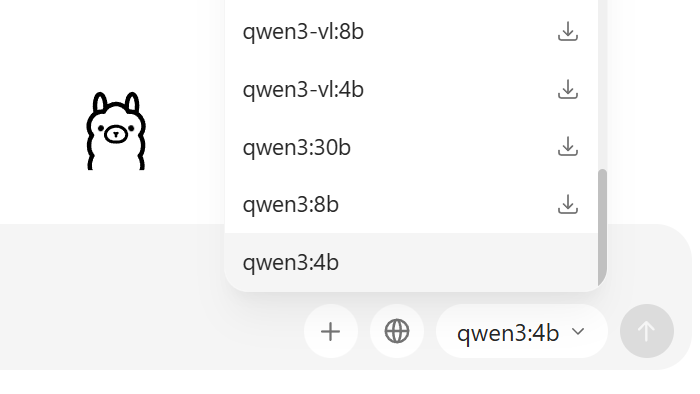
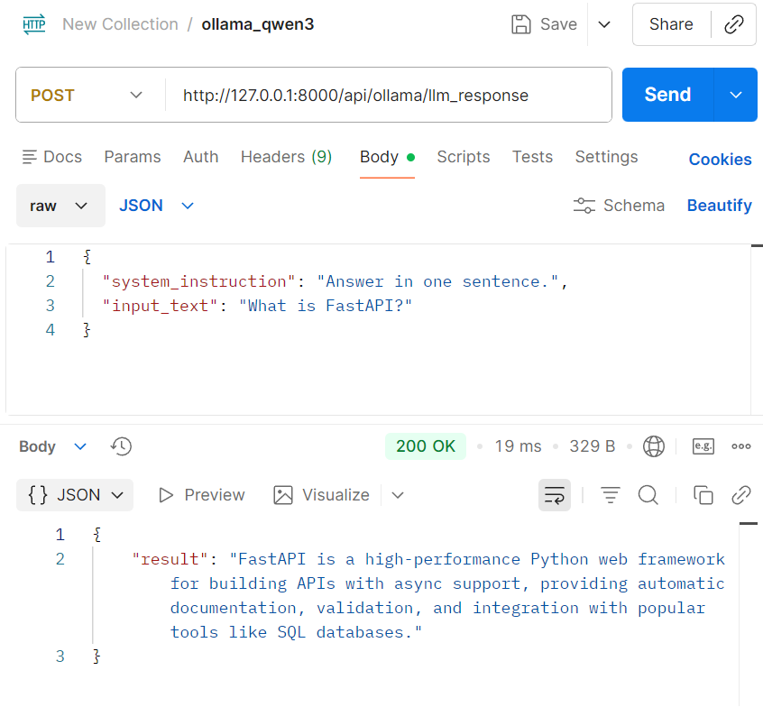

Couple things to note:
# We have 3 blackboxes
- RoBERTa blackbox 
    - input: ONE STRING (claim)
    - output: those things in the paper
- Chat AI blackbox
    - input: TWO STRINGS (system instruction, input string)
    - output: ONE STRING (result)
- Storing result blackbox
    - input: that result from #10
    - output: nothing. it's gonna store those json result.
        - this will be used during retraining pipeline (working on that)

# Install OLLAMA
1. Go https://ollama.com/download/windows and download whatever version
2. 
    - download qwen3:4b model (~2.5 GB)
3. download postman
    - https://www.postman.com/downloads/
4. 
    - put that things and hit send
    - you'll get response